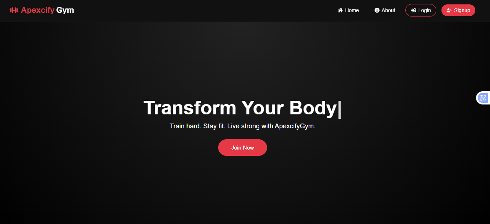
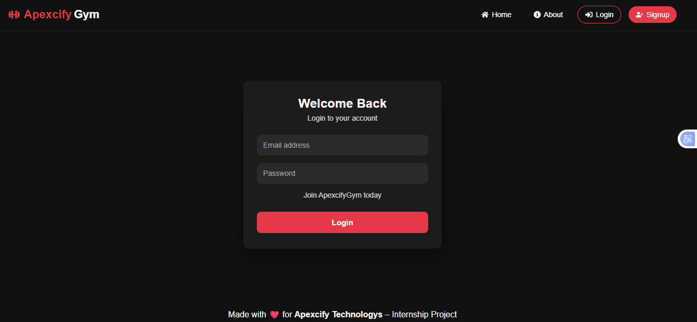
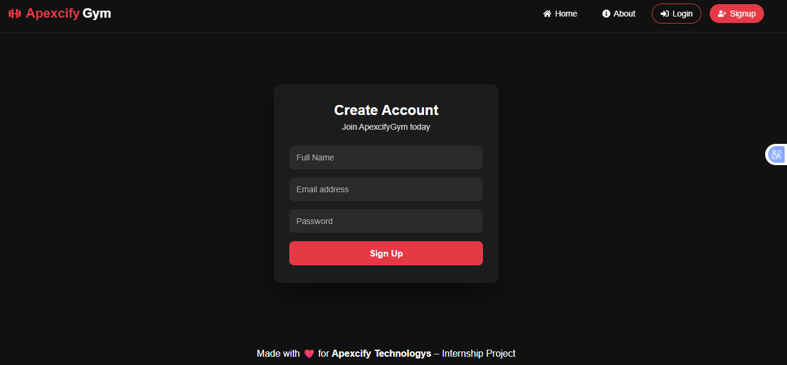
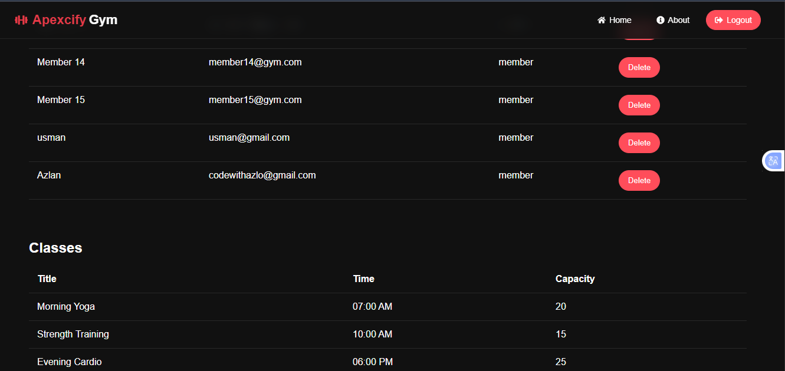
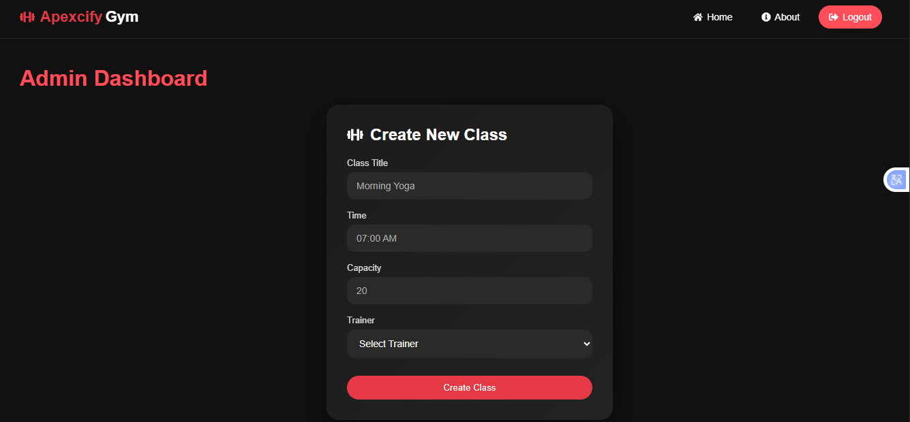
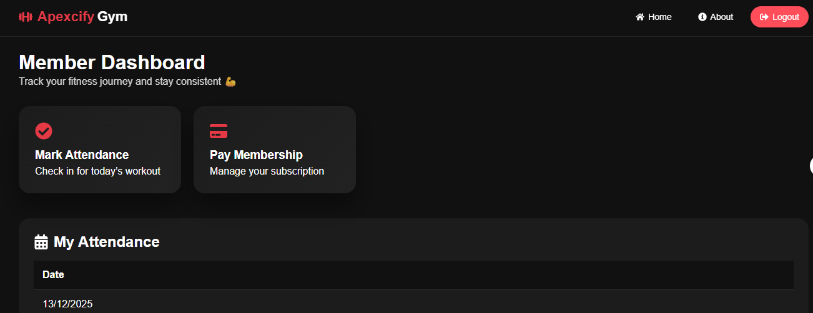

# 🔎 Project Management System

### Internship Task Project

<p align="center">
  
  
</p>

<p align="center">
  
</p>

---

## 🚀 Project Overview

This is a **full-stack Gym Management System** developed as part of an **internship task**.  
The application is designed to manage **gym members, classes, attendance, and payments** with role-based dashboards.

The project uses **modern frontend and backend architecture**, ensuring scalability, maintainability, and performance.

---

## Key Features

Secure Authentication: JWT-based login and registration.

Role-Based Dashboards: Distinct interfaces for Admins, Trainers, and Members.

Class Management: Admins can create, update, and assign trainers to fitness classes.

Attendance Tracking: Real-time monitoring of member participation.

Automated Workflows: Background jobs handled via Cron Jobs.

Cloud Database: Fully integrated with MongoDB Atlas.

## 🧩 How the System Works

- Users can **sign up and log in**
- Role-based access:
  - **Admin** manages classes, members, attendance, and payments
  - **Members** view classes, attendance, and payment status
- Attendance is tracked per class
- Payments are handled securely
- Automated background jobs run using **cron jobs**

---

## 🧠 Backend Overview (Node.js + Express)

The backend is built with **Node.js**, **Express**, and **MongoDB**, following REST API best practices.

### Backend Responsibilities

- Authentication & authorization
- User & member management
- Class creation & scheduling
- Attendance tracking
- Payment handling
- Automated cron jobs

### Backend Entry Point

```js
const express = require("express");
const cors = require("cors");

const authRoutes = require("./routes/authRoutes");
const userRoutes = require("./routes/userRoutes");
const classRoutes = require("./routes/classRoutes");
const attendanceRoutes = require("./routes/attendanceRoutes");
const paymentRoutes = require("./routes/paymentRoutes");
require("./utils/cronJob");

const app = express();

app.use(cors());
app.use(express.json());

app.use("/api/auth", authRoutes);
app.use("/api/users", userRoutes);
app.use("/api/classes", classRoutes);
app.use("/api/attendance", attendanceRoutes);
app.use("/api/payments", paymentRoutes);

module.exports = app;
```

## 🎨 Frontend Overview (React)

The frontend is built using React 18 with a clean and scalable architecture.

Frontend Features

Authentication pages (Login / Signup)

Admin dashboard

Member dashboard

Class creation & management

Attendance view

Payment interface

Responsive UI

## 🧑‍💻 Tech Stack

🖥️ Frontend

<p>       </p>
## 🧠 Backend
<p>   </p>
## 🗄️ Database & Services
<p>   </p>

## 📂 Project Structure

```
root/
│── gym-backend/
│   ├── routes/
│   ├── controllers/
│   ├── models/
│   ├── utils/
│   │   └── cronJob.js
│   └── app.js
│
│── gym-frontend/
│   ├── src/
│   │   ├── assets/
│   │   │   ├── home.png
│   │   │   ├── login.png
│   │   │   ├── signup.png
│   │   │   ├── admindash.png
│   │   │   ├── create.png
│   │   │   └── memberdash.png
│   │   ├── components/
│   │   ├── pages/
│   │   └── App.jsx
│
└── README.md
```

## 🖼️ Application Screenshots

🏠 Home Page


🔐 Login Page


📝 Signup Page



🧑‍💼 Admin Dashboard


➕ Create Class

🏃 Member Dashboard


## ⚙️ Environment Variables

```
Backend (.env)
PORT=5000
MONGO_URI=your_mongodb_connection_string
JWT_SECRET=your_jwt_secret_key
STRIPE_SECRET=sk_test_your_stripe_key
```

## ▶️ Running the Project Locally

```
Backend
cd gym-backend
npm install
npm run dev
```

## Frontend

```
cd gym-frontend
npm install
npm start
```

## 🧠 Best Practices Followed

Modular backend architecture

RESTful API design

Axios interceptors for API handling

Server-state management with TanStack Query

Global state management using Zustand

Secure authentication flow

Cron jobs for background automation

Clean and responsive UI

## 📌 Future Enhancements

Subscription plans

Trainer management

Reports & analytics

Notifications system

Deployment with Docker & CI/CD

## 👨‍💻 Author

Project Type: Internship Task

Role: Full-Stack Developer

## ⭐ Support

If you like this project, give it a ⭐ on GitHub!

---

## 🔐 Default Credentials (Post-Seed)

After running the seed script, use these to log in:

Admin: admin@gym.com / password123

Trainer: trainer1@gym.com / password123

## 👨‍💻 Author

Haroon Ahmad Full-Stack Developer | Computer Science Student
